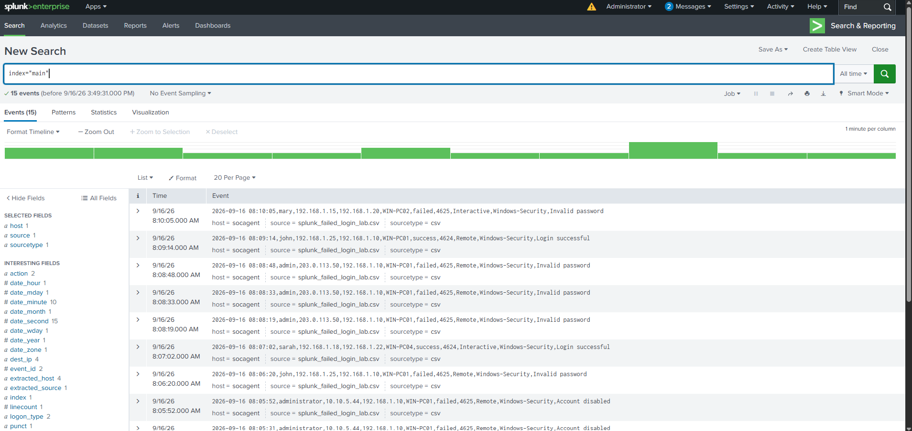
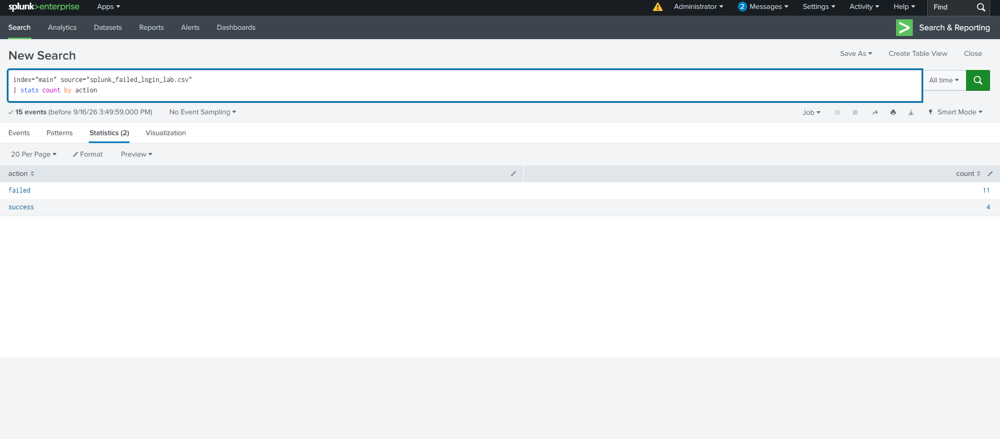
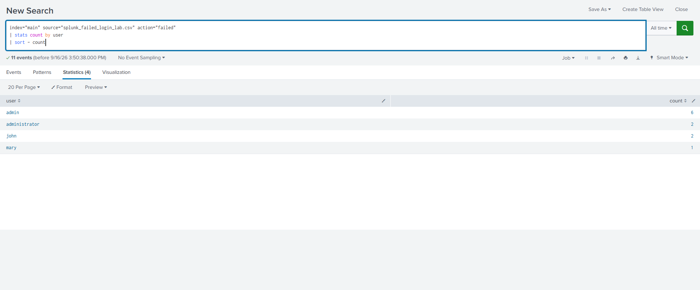
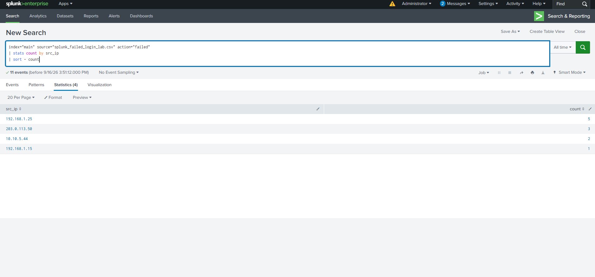
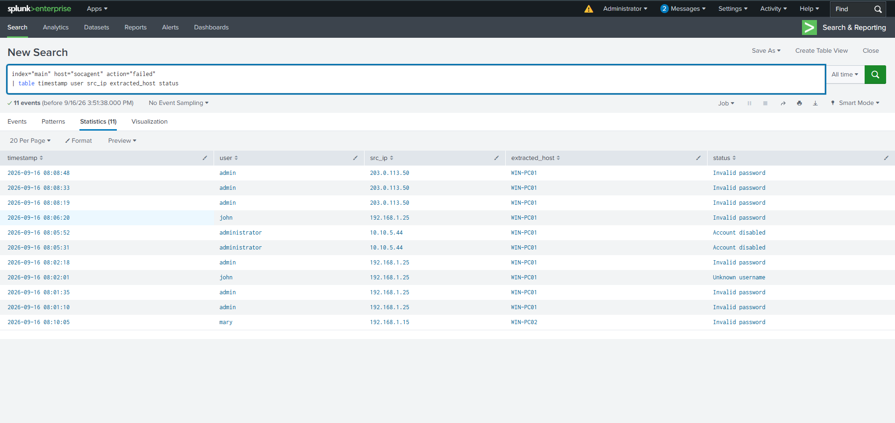
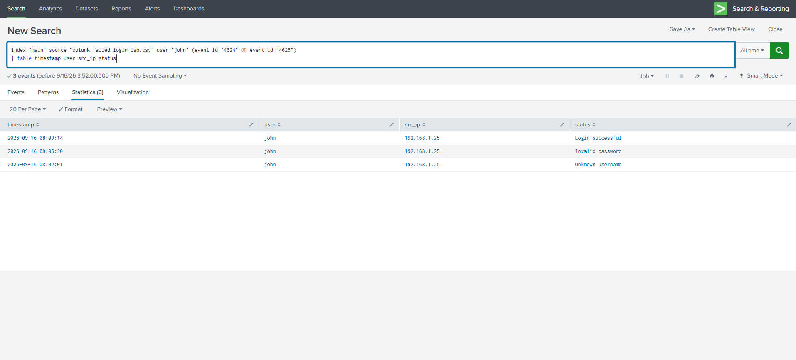

# Screenshot Evidence

These six original screenshots have been copied as PNG images and named in investigation order.

| Image | Evidence |
| --- | --- |
| [01-events-overview.png](01-events-overview.png) | 15 ingested events; CSV source and extracted fields |
| [02-login-status.png](02-login-status.png) | 11 failed and 4 successful logins |
| [03-failed-users.png](03-failed-users.png) | admin: 6; administrator: 2; john: 2; mary: 1 |
| [04-source-ips.png](04-source-ips.png) | Failed attempts by source IP: 5, 3, 2, and 1 |
| [05-failed-login-details.png](05-failed-login-details.png) | 11 failures, endpoint names, timestamps, accounts, and failure reasons |
| [06-john-failed-to-success.png](06-john-failed-to-success.png) | John's two failures and later success from the same source IP |

## Raw Authentication Events

## Failed and Successful Login Counts

## Failed Attempts by User

## Failed Attempts by Source IP

## Failed Login Details and Timeline

The table shows 10 failures against WIN-PC01 and one against WIN-PC02. Three admin failures from 203.0.113.50 occur at 08:08:19, 08:08:33, and 08:08:48, spanning 29 seconds. The account names alone do not verify actual privilege assignments.

## John's Failed-to-Successful Login Sequence

Read chronologically: 08:02:01 unknown username, 08:06:20 invalid password, and 08:09:14 login successful. All three events use 192.168.1.25. This sequence is an observation and does not by itself prove compromise.

## Evidence Scope

The IPs, usernames, and hosts belong to the simulated lab dataset. Separate endpoint-count and privileged-account-count screenshots were not supplied; the detailed failure table supports those documented counts. Original screenshot files remain in their source folder.
