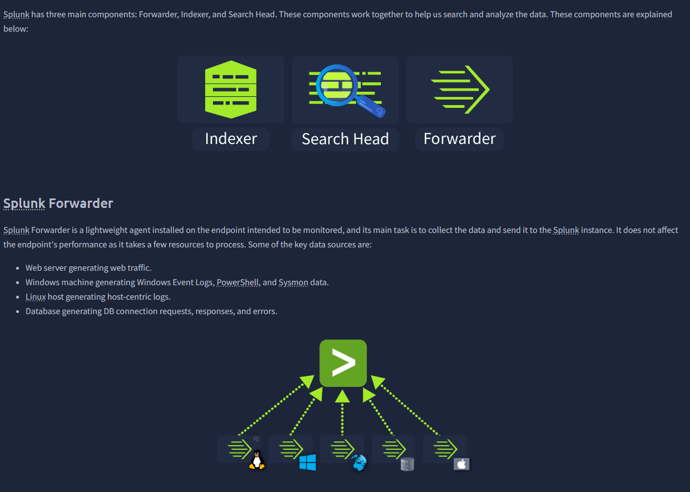
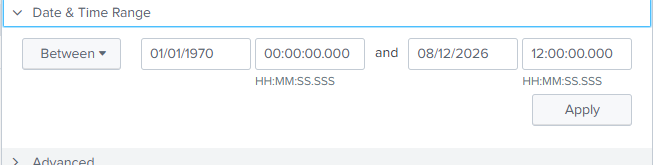
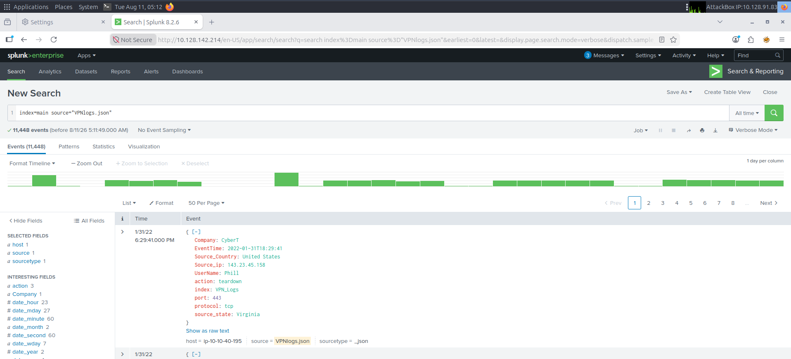
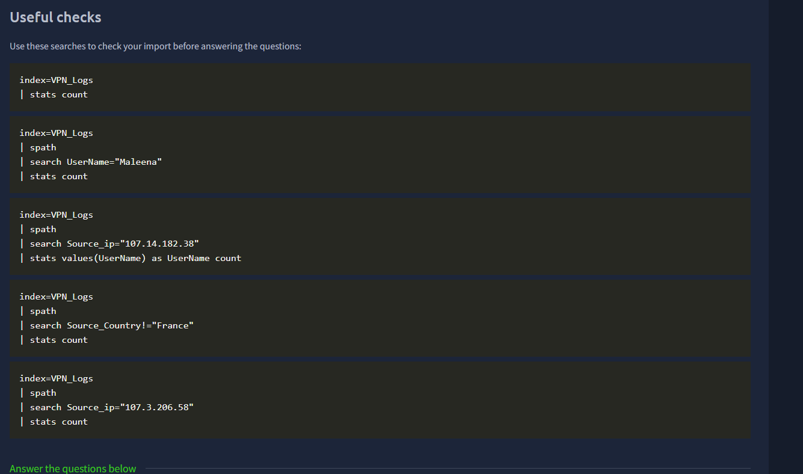
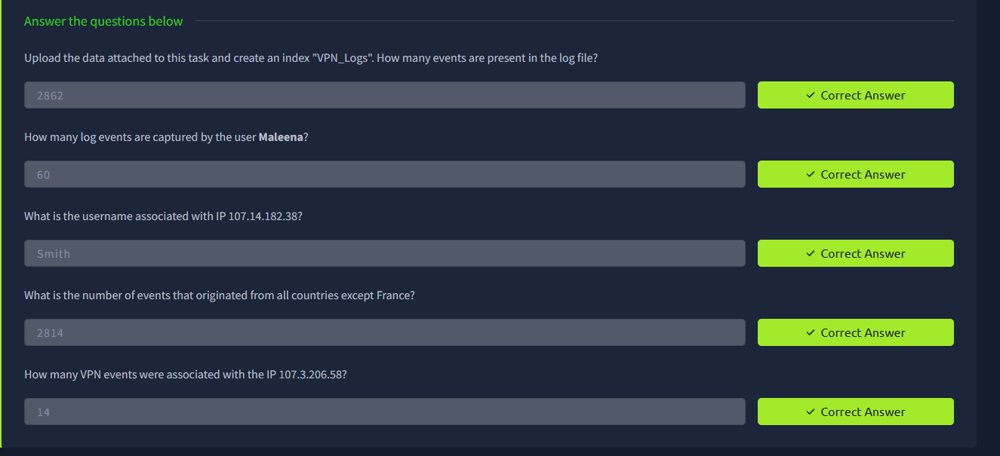
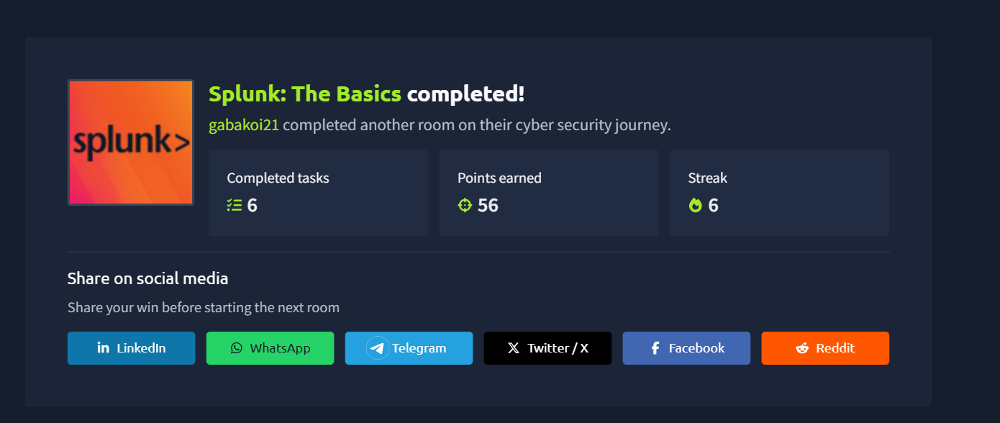
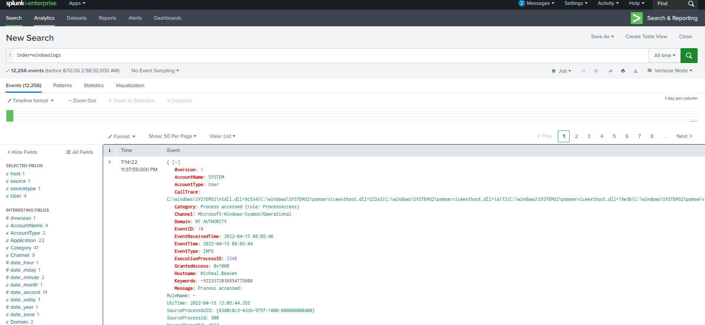

# Screenshot Evidence

The supplied screenshots document the following parts of the lab:

| Evidence | What it demonstrates |
| --- | --- |
| Verified TryHackMe answers | Completion of the VPN-log questions and confirmation of all five findings |
| Useful SPL checks | Queries used to validate ingestion and investigate usernames, IP addresses, and countries |
| Splunk architecture | The relationship between the indexer, search head, and forwarder |
| Time-range configuration | Selection of a broad date range so historical events are not excluded |
| Search & Reporting interface | Event searching, field inspection, and result navigation in Splunk Enterprise |
| Room completion | Completion of all six tasks in the TryHackMe room |
| Splunk home screen | Familiarity with applications, search, dashboards, and learning resources |

## Verified VPN Results

- Total VPN events: **2,862**
- Events for `Maleena`: **60**
- Username for `107.14.182.38`: **Smith**
- Events from countries other than France: **2,814**
- Events for `107.3.206.58`: **14**

## Repository Note

The available images have been inspected, moved into this directory, and given descriptive names. A separate Splunk home-screen image was not present, so no misleading `01-splunk-home.png` file was created. The additional Windows-log search is retained as supplemental interface evidence and is not presented as part of the VPN findings.

## Evidence Gallery

### Splunk Components

### Time-Range Configuration

### VPN Events in Search & Reporting

### VPN Investigation Queries

### Verified Results

### Room Completion

### Supplemental Search Interface Evidence

Before publishing, confirm that screenshots do not expose credentials, flags, personal information, internal addresses, or unrelated browser content. The VPN Search & Reporting screenshot includes private lab IP addresses belonging to the isolated TryHackMe environment.
