# Screenshot Evidence

These screenshots document the SSH log analysis workflow in Splunk Enterprise.

| Image | Evidence |
| --- | --- |
| [architecture-overview.jpg](architecture-overview.jpg) | Lab overview showing SSH log sample ingestion into Splunk |
| [01-add-data-options.png](01-add-data-options.png) | Splunk Add Data page with upload, monitor, and forward options |
| [02-upload-ssh-logs.png](02-upload-ssh-logs.png) | `ssh_logs.json` selected and uploaded successfully |
| [03-source-type-preview.png](03-source-type-preview.png) | JSON event preview with extracted SSH fields |
| [04-input-settings-index.png](04-input-settings-index.png) | Input settings showing the `ssh_logs` index |
| [05-review-upload.png](05-review-upload.png) | Review page showing file name, source type, host, and index |
| [06-upload-success.png](06-upload-success.png) | Splunk confirmation that the file was uploaded successfully |
| [07-event-type-counts.png](07-event-type-counts.png) | SPL statistics showing counts by SSH event type |
| [08-failed-login-chart.png](08-failed-login-chart.png) | Failed SSH login visualization by source IP |
| [09-multiple-failed-attempts.png](09-multiple-failed-attempts.png) | Multiple failed authentication attempts by source and destination |
| [10-successful-login-stats.png](10-successful-login-stats.png) | Successful SSH login activity by source and destination |
| [11-connection-without-authentication.png](11-connection-without-authentication.png) | Connections without authentication grouped by source IP |
| [12-timechart-unauthenticated-connections.png](12-timechart-unauthenticated-connections.png) | Timechart of unauthenticated SSH connections by source IP |

## Architecture Overview

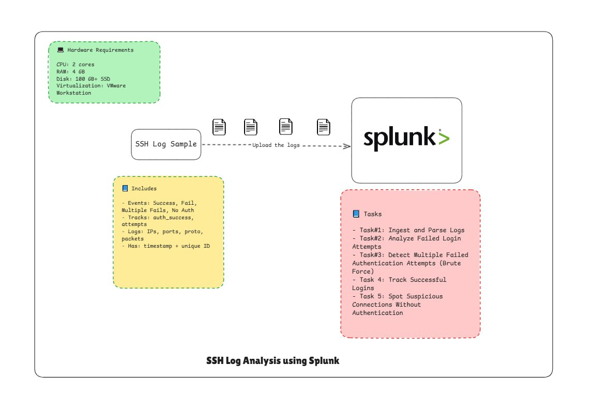

## Add Data Workflow

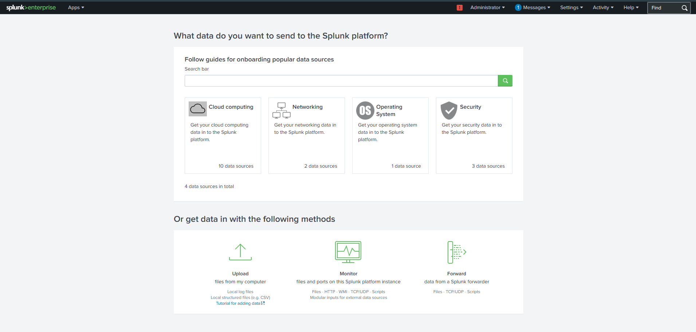

## Upload SSH Logs

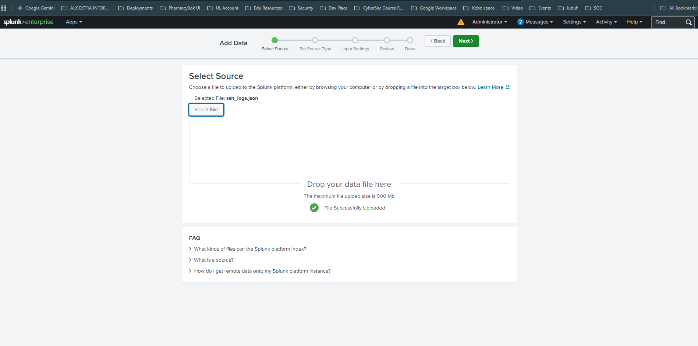

## Source Type Preview

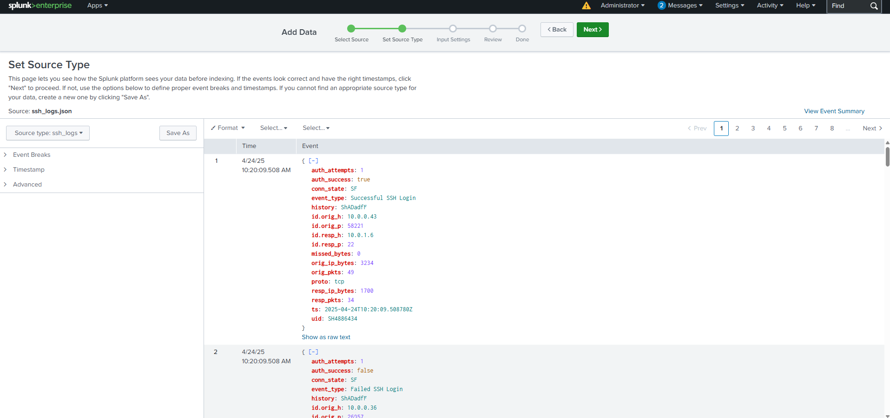

## Input Settings

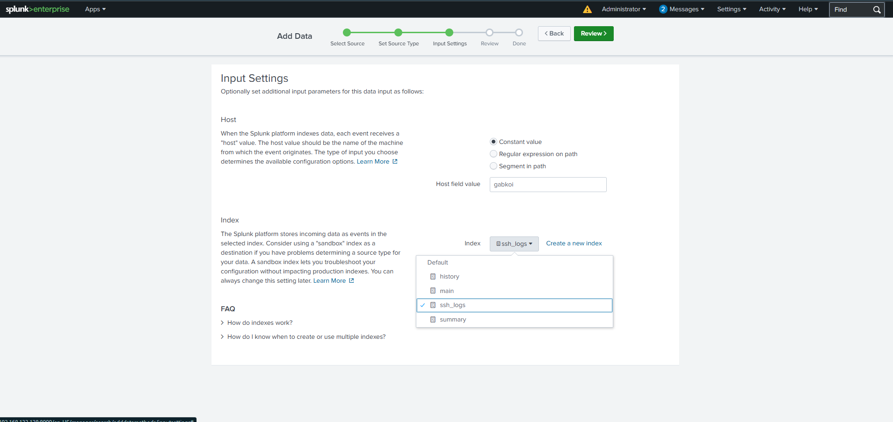

## Review Upload Settings

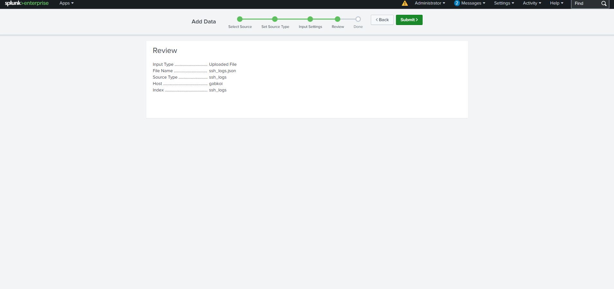

## Upload Confirmation

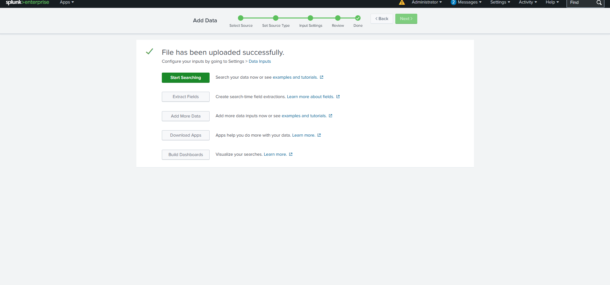

## Event Type Counts

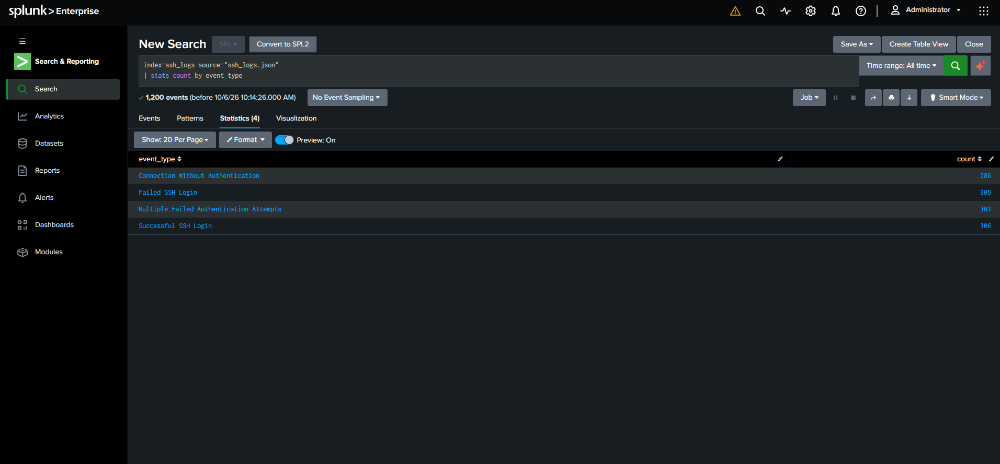

The search returned 1,200 total events across four event categories: successful logins, failed logins, multiple failed authentication attempts, and connections without authentication.

## Failed Login Visualization

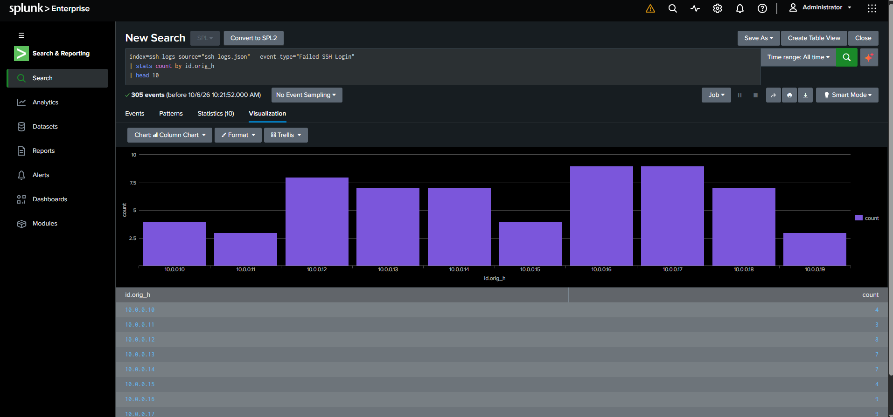

## Multiple Failed Authentication Attempts

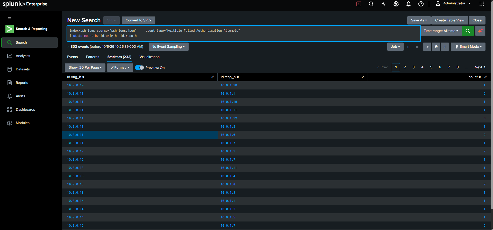

## Successful SSH Logins

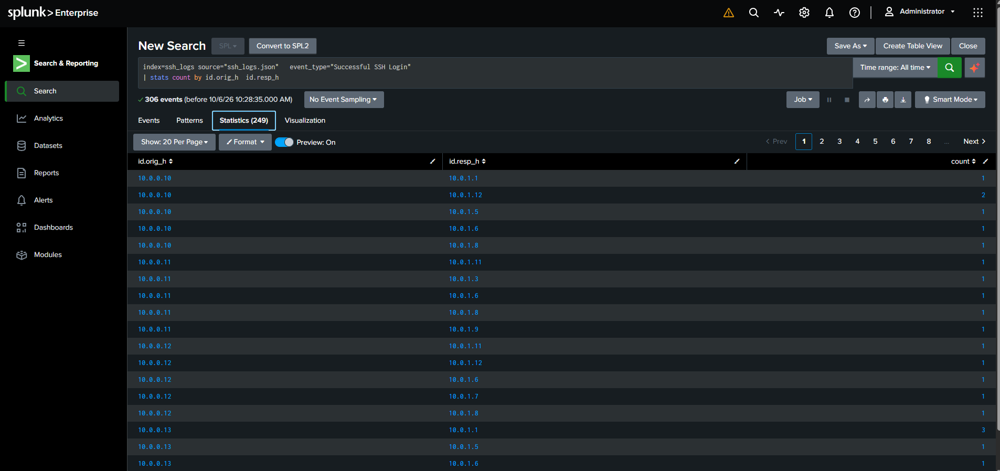

## Connections Without Authentication

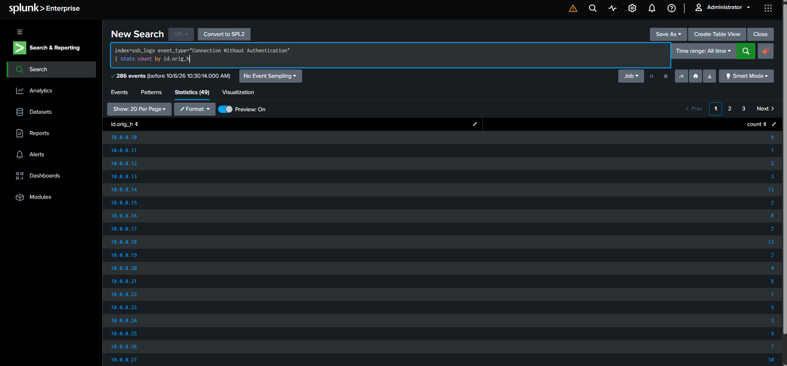

## Timechart of Unauthenticated Connections

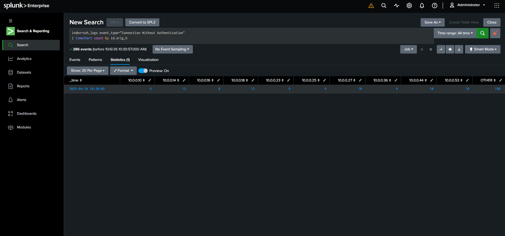

## Evidence Scope

The screenshots come from a local Splunk Enterprise lab using a provided SSH log dataset. The original `ssh_logs.json` dataset is not included in this repository.
